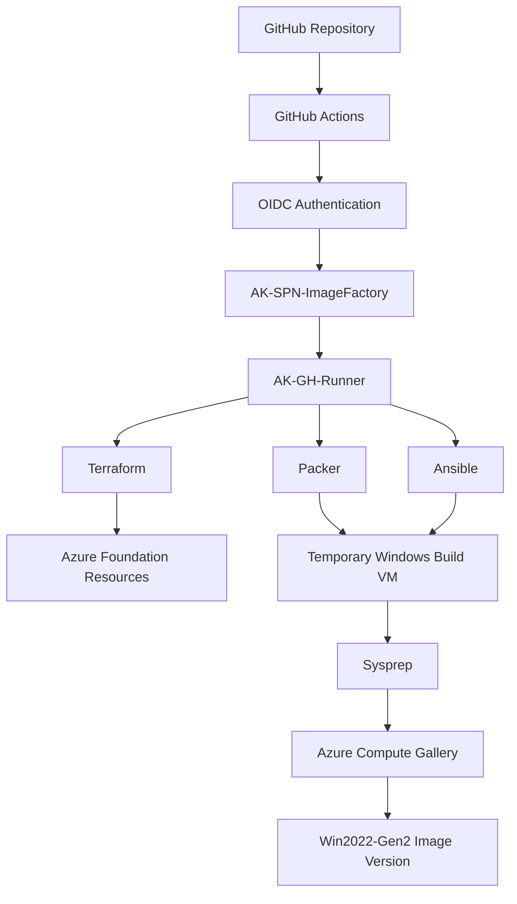
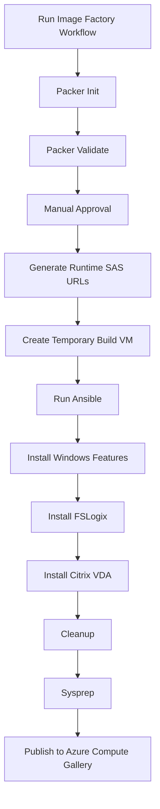

# Azure Image Factory - End-to-End Knowledge Transfer Guide

## 1. Executive Summary

This README is a complete Knowledge Transfer document for the Azure Image Factory built in the `akumar2oo2/Image_Factory` GitHub repository.

The solution automates the creation of Windows golden images using Terraform, GitHub Actions, OIDC authentication, a self-hosted GitHub runner, Packer, Ansible, Azure Storage, and Azure Compute Gallery.

The goal of this implementation is to follow an enterprise-style pattern even though the environment is a personal lab. The final design avoids long-lived secrets, keeps Terraform state remote, uses approval gates for destructive or image-building actions, keeps build infrastructure private where possible, and separates responsibilities clearly across Terraform, Packer, Ansible, and GitHub Actions.

---

## 2. What This Platform Does

The Image Factory performs the following high-level activities:

1. Uses Terraform to deploy Azure foundation resources.
2. Uses GitHub Actions with OIDC to authenticate to Azure without client secrets.
3. Uses Azure Storage to store software installers such as FSLogix and Citrix VDA.
4. Uses a self-hosted GitHub runner to execute Terraform, Packer, and Ansible workloads.
5. Uses Packer to create a temporary Windows Server build VM.
6. Uses Ansible to configure the Windows build VM.
7. Installs Windows features, FSLogix, Citrix VDA, and supporting components.
8. Runs Sysprep.
9. Publishes the final image into Azure Compute Gallery.

---

## 3. Final Architecture

```text
GitHub Repository: akumar2oo2/Image_Factory
        |
        v
GitHub Actions Workflows
        |
        v
OIDC Authentication
        |
        v
AK-SPN-ImageFactory
        |
        v
AK-GH-Runner Self-Hosted Runner
        |
        |-- Terraform deploys Azure foundation
        |-- Packer creates temporary image build VM
        |-- Ansible configures Windows image
        |
        v
Azure Compute Gallery: AKACGImages
        |
        v
Image Definition: Win2022-Gen2
        |
        v
Image Versions: 1.0.0, 1.0.1, 1.0.2, etc.
```

---

## 4. Simple Architecture Diagram



---

## 5. Important Azure Portal Paths

### 5.1 Terraform State Storage

```text
Azure Portal
→ Resource Groups
→ AK-RG-TFState
→ Storage Account: aksttfstate
→ Containers
→ tfstate
→ imagefactory.tfstate
```

Purpose:

```text
Stores Terraform remote state.
Prevents local state file usage.
Supports state locking.
```

---

### 5.2 Network Resources

```text
Azure Portal
→ Resource Groups
→ AK-RG-Network
→ AK-VNET
→ Subnets
```

Expected subnets:

```text
AK-Runner-Subnet
AK-Build-Subnet
```

Purpose:

```text
AK-Runner-Subnet hosts the self-hosted runner.
AK-Build-Subnet hosts temporary Packer image build VMs.
```

---

### 5.3 Runner VM

```text
Azure Portal
→ Resource Groups
→ AK-RG-Runner
→ Virtual Machine
→ AK-GH-Runner
```

Purpose:

```text
Runs GitHub Actions jobs for Terraform, Packer, and Ansible.
```

---

### 5.4 Image Factory Build Resources

```text
Azure Portal
→ Resource Groups
→ AK-RG-ImageFactory
```

Purpose:

```text
Packer temporarily creates VM, NIC, disk, and related build resources here.
These resources are expected to be cleaned up automatically after build completion.
```

---

### 5.5 Azure Compute Gallery

```text
Azure Portal
→ Resource Groups
→ AK-RG-Images
→ Azure Compute Gallery
→ AKACGImages
→ Image Definitions
→ Win2022-Gen2
→ Versions
```

Purpose:

```text
Stores final golden image versions.
```

---

### 5.6 Software Installer Storage

```text
Azure Portal
→ Resource Groups
→ AK-RG-ImageFactory
→ Storage Account
→ akifsoftware
→ Containers
→ software
```

Expected files:

```text
FSLogixAppsSetup.exe
VDAServerSetup_2603.exe
```

Purpose:

```text
Stores large software installers outside GitHub.
Pipeline generates short-lived SAS URLs at runtime to download these installers.
```

---

## 6. Important GitHub Paths

### 6.1 Repository

```text
GitHub
→ akumar2oo2
→ Image_Factory
```

---

### 6.2 GitHub Actions Workflows

```text
GitHub
→ Image_Factory
→ Actions
```

Expected workflows:

```text
Terraform
Image Factory
```

---

### 6.3 GitHub Secrets

```text
GitHub
→ Image_Factory
→ Settings
→ Secrets and variables
→ Actions
→ Repository secrets
```

Required secrets:

| Secret Name | Purpose |
|---|---|
| AZURE_CLIENT_ID | Client ID of AK-SPN-ImageFactory |
| AZURE_TENANT_ID | Azure tenant ID |
| AZURE_SUBSCRIPTION_ID | Azure subscription ID |
| WINRM_PASSWORD | Password used by Packer for Windows WinRM connection |

There is no Azure client secret because the solution uses OIDC.

---

### 6.4 GitHub Environments

```text
GitHub
→ Image_Factory
→ Settings
→ Environments
```

Expected environments:

| Environment | Purpose |
|---|---|
| production | Terraform apply or destroy approval gate |
| imagefactory | Packer image build approval gate |

---

### 6.5 GitHub Self-Hosted Runner

```text
GitHub
→ Image_Factory
→ Settings
→ Actions
→ Runners
→ AK-GH-Runner
```

Expected status:

```text
Idle
```

or during a job:

```text
Active
```

---

## 7. Important Runner VM Paths

Connect to the runner VM through SSH:

```text
ssh -i <private-key-file> githubrunner@<runner-public-ip>
```

Runner home path:

```text
/home/githubrunner
```

GitHub runner installation path:

```text
/home/githubrunner/actions-runner
```

Runner service commands:

```bash
cd ~/actions-runner
sudo ./svc.sh status
sudo ./svc.sh start
sudo ./svc.sh stop
```

Check installed tools:

```bash
az version
terraform version
packer version
ansible --version
python3 --version
```

Verify WinRM dependency:

```bash
python3 -c "import winrm"
```

If the command returns no output, the module is installed correctly.

---

## 8. Bootstrap Phase

### 8.1 What Is the Bootstrap Phase?

The bootstrap phase is the minimum setup required before Terraform, Packer, and GitHub Actions can operate safely.

Bootstrap resources are created manually because Terraform cannot store state in a backend that does not exist yet.

### 8.2 Bootstrap Resources

| Resource | Created By | Why |
|---|---|---|
| AK-RG-TFState | Manual | Stores Terraform backend resources |
| aksttfstate | Manual | Storage account for Terraform state |
| tfstate container | Manual | Blob container for state file |
| AK-SPN-ImageFactory | Manual | Identity used by GitHub OIDC |
| Federated Credentials | Manual | Allows GitHub workflows to authenticate |
| GitHub Secrets | Manual | Stores non-secret IDs required by Azure login |

### 8.3 Bootstrap Flow

```text
Create AK-RG-TFState
        ↓
Create aksttfstate Storage Account
        ↓
Create tfstate Container
        ↓
Create AK-SPN-ImageFactory App Registration
        ↓
Assign Contributor role on subscription for initial deployment
        ↓
Assign Storage Blob Data Contributor on aksttfstate
        ↓
Create GitHub OIDC Federated Credentials
        ↓
Create GitHub Repository Secrets
        ↓
Run Terraform Workflow
```

---

## 9. Why OIDC Is Better Than Client Secrets

### 9.1 Traditional Client Secret Approach

```text
GitHub Secret stores client secret
        ↓
Workflow uses client secret
        ↓
Azure issues token
```

Problems:

| Problem | Impact |
|---|---|
| Secret expiration | Pipeline failure |
| Manual rotation | Operational overhead |
| Secret leakage | Security incident |
| Long-lived credential | Larger attack surface |

### 9.2 OIDC Approach

```text
GitHub workflow requests temporary token
        ↓
Microsoft Entra validates repository and environment
        ↓
Azure grants short-lived access
```

Benefits:

| Benefit | Explanation |
|---|---|
| No Azure password | No client secret stored in GitHub |
| Short-lived token | Token exists only during workflow execution |
| Environment scoping | Terraform and image builds use separate GitHub environments |
| Better security | Reduces credential leakage risk |
| Enterprise pattern | Aligns with modern CI/CD security practices |

---

## 10. Federated Credentials

The app registration used by pipelines is:

```text
AK-SPN-ImageFactory
```

Federated credential for Terraform environment:

```text
Name: AK-GitHubEnv-OIDC
Subject: repo:akumar2oo2/Image_Factory:environment:production
```

Federated credential for Image Factory environment:

```text
Name: AK-GitHubImageFactory-OIDC
Subject: repo:akumar2oo2/Image_Factory:environment:imagefactory
```

Important point:

```text
Azure matches OIDC authentication using issuer, subject, and audience.
The credential name is only for human readability.
```

---

## 11. Why Self-Hosted Runner Is Better Here

### 11.1 GitHub-Hosted Runner Pattern

```text
Start temporary GitHub VM
        ↓
Install tools
        ↓
Run job
        ↓
Delete VM
```

Limitations:

| Limitation | Impact |
|---|---|
| Tools installed every run | Slower pipeline |
| No private network access by default | Harder to use private build VMs |
| Less control | Cannot fully customize environment |
| Ephemeral VM | Troubleshooting is harder |

### 11.2 Self-Hosted Runner Pattern

```text
AK-GH-Runner already exists
        ↓
Tools already installed
        ↓
Workflow starts immediately
        ↓
Can access Azure private network
```

Benefits:

| Benefit | Explanation |
|---|---|
| Faster execution | Terraform, Packer, Ansible already installed |
| Private networking | Runner can reach private Packer build VM |
| Easier troubleshooting | SSH access available |
| Better control | VM size, packages, labels, and runtime are controlled |
| Enterprise style | Matches typical corporate build architecture |

---

## 12. Terraform Design

Terraform is responsible for Azure foundation resources.

Terraform creates:

```text
AK-RG-Network
AK-RG-Runner
AK-RG-ImageFactory
AK-RG-Images
AK-VNET
AK-Runner-Subnet
AK-Build-Subnet
AKACGImages
Win2022-Gen2 image definition
```

Terraform does not create:

```text
AK-RG-TFState
aksttfstate
state container
```

Those are bootstrap resources.

### 12.1 Terraform Workflow

```text
GitHub Actions
        ↓
Azure OIDC Login
        ↓
Terraform Init
        ↓
Terraform Validate
        ↓
Terraform Plan
        ↓
Manual Approval
        ↓
Terraform Apply
```

### 12.2 Terraform Remote State

State location:

```text
AK-RG-TFState
→ aksttfstate
→ tfstate
→ imagefactory.tfstate
```

Purpose:

```text
Tracks Azure resources managed by Terraform.
Allows safe updates.
Prevents local state file usage.
Supports locking.
```

---

## 13. Packer Design

Packer is responsible for image lifecycle.

Packer does:

```text
Authenticate using Azure CLI session created by OIDC
Create temporary Windows Server VM
Configure WinRM
Run Ansible
Run Sysprep
Capture image
Publish image to Azure Compute Gallery
Clean up temporary resources
```

Packer file path:

```text
packer/AK-IF.pkr.hcl
```

Final image target:

```text
AK-RG-Images
→ AKACGImages
→ Win2022-Gen2
→ Versions
```

---

## 14. Ansible Design

Ansible handles the Windows configuration inside the temporary build VM.

Ansible entry point:

```text
ansible/playbook.yml
```

Roles:

```text
ansible/roles/windows_features.yml
ansible/roles/fslogix.yml
ansible/roles/citrix_vda.yml
ansible/roles/cleanup.yml
```

Execution order:

```text
Windows Features
        ↓
FSLogix
        ↓
Citrix VDA
        ↓
Cleanup
```

### 14.1 Windows Features

Installs:

```text
RDS-RD-Server
Server-Media-Foundation
```

### 14.2 FSLogix

Tasks:

```text
Create working directory
Download installer
Install FSLogix
Validate installation
```

### 14.3 Citrix VDA

Tasks:

```text
Create working directory
Download VDA installer
Install VDA
Collect precheck logs
Validate required Citrix components
```

### 14.4 Cleanup

Tasks:

```text
Optional pause
Remove FSLogix temporary folder
Remove Citrix temporary folder
```

---

## 15. Software Installer Strategy

Installers are stored in Azure Storage, not GitHub.

Reason:

```text
Installers are large files.
GitHub should not store large binaries.
Azure Storage provides secure central access.
The pipeline can generate short-lived SAS URLs at runtime.
```

Storage path:

```text
Azure Portal
→ AK-RG-ImageFactory
→ akifsoftware
→ Containers
→ software
```

Expected blob names:

```text
FSLogixAppsSetup.exe
VDAServerSetup_2603.exe
```

---

## 16. Runtime SAS Design

### 16.1 Rejected Approach

```text
Hardcoded SAS URL in repository or secrets
```

Problems:

```text
Can expire unexpectedly
Can be exposed accidentally
Requires rotation
Not ideal for enterprise pattern
```

### 16.2 Final Approach

```text
Manual approval
        ↓
Generate SAS inside build job
        ↓
Mask SAS values in logs
        ↓
Pass URL to Packer
        ↓
Ansible downloads installers
```

Benefits:

| Benefit | Explanation |
|---|---|
| Short-lived access | SAS exists only briefly |
| No stored SAS | SAS not committed or stored permanently |
| Better security | SAS is generated after approval |
| Avoids expiry during approval wait | SAS is not generated before manual approval |

---

## 17. GitHub Workflows

### 17.1 Terraform Workflow

Path:

```text
.github/workflows/terraform.yml
```

Purpose:

```text
Deploy or destroy Terraform-managed Azure infrastructure.
```

Actions:

```text
apply
destroy
```

Approval environment:

```text
production
```

---

### 17.2 Image Factory Workflow

Path:

```text
.github/workflows/image_factory.yml
```

Purpose:

```text
Build Windows golden image using Packer and Ansible.
```

Approval environment:

```text
imagefactory
```

Main phases:

```text
Packer Init
Packer Validate
Approval
Generate SAS
Packer Build
Ansible Configuration
Sysprep
Publish Image
```

---

## 18. Image Build Flow



---

## 19. How to Build a New Image

1. Go to GitHub.
2. Open `akumar2oo2/Image_Factory`.
3. Go to `Actions`.
4. Select `Image Factory` workflow.
5. Select `Run workflow`.
6. Enter an image version such as `1.0.1`.
7. Start the workflow.
8. Wait for validation to complete.
9. Approve the `imagefactory` environment deployment.
10. Wait for Packer and Ansible to complete.
11. Verify the new version in Azure Compute Gallery.

---

## 20. Where to Check Final Image

```text
Azure Portal
→ Resource Groups
→ AK-RG-Images
→ AKACGImages
→ Image Definitions
→ Win2022-Gen2
→ Versions
```

Expected result:

```text
Image version appears with Succeeded provisioning state.
```

---

## 21. How to Validate the Image

Create a test VM:

```text
Azure Portal
→ Azure Compute Gallery
→ AKACGImages
→ Win2022-Gen2
→ Select image version
→ Create VM
```

Then check installed applications:

```text
FSLogix
Citrix Virtual Apps and Desktops
Citrix Workspace
Citrix Secure Access Endpoint Analysis
Citrix Workspace Environment Management Agent
deviceTRUST Agent
```

---

## 22. Troubleshooting Guide

| Issue | Symptom | Root Cause | Fix |
|---|---|---|---|
| AADSTS700213 | Azure login fails | Federated credential subject mismatch | Create matching environment credential |
| QuotaExceeded | Packer VM creation fails | VM family quota is zero | Use another VM size or request quota |
| No module named winrm | Ansible fails | pywinrm missing in runner service context | Install pywinrm system-wide |
| Relative URI | FSLogix download fails | URL variable is empty | Validate Packer to Ansible variable passing |
| Unset variable | Packer validate fails | Required variables missing | Pass placeholder installer URLs during validate |
| VNET not found | Subnet creation fails | Terraform dependency issue | Reference VNET resource correctly |
| SAS expired | Download fails with authorization error | SAS generated too early | Generate SAS after approval |

---

## 23. Lessons Learned

### 23.1 OIDC Subject Must Match Exactly

When GitHub uses an environment, the OIDC subject changes to:

```text
repo:akumar2oo2/Image_Factory:environment:<environment-name>
```

Azure must have a matching federated credential.

---

### 23.2 Generate SAS After Approval

Generating SAS before approval caused expiry and output-passing complexity.

Final decision:

```text
Generate SAS only after approval and immediately before image build.
```

---

### 23.3 Self-Hosted Runner Should Run as a Service

Do not use:

```bash
./run.sh
```

Use:

```bash
sudo ./svc.sh install
sudo ./svc.sh start
```

Reason:

```text
Runner continues after SSH session closes.
Runner starts automatically after VM reboot.
```

---

### 23.4 Packer Validate Still Requires Variables

Even if Packer validate does not download installers, it still requires values for variables unless defaults are provided.

Fix:

```text
Use placeholder installer URLs during validation.
```

---

### 23.5 Azure Quota Can Block Correct Code

Packer may fail even when the code is correct if the subscription has no quota for the selected VM family.

Check:

```text
Azure Portal
→ Subscription
→ Usage + quotas
```

---

### 23.6 Runner Python Dependencies Must Be Available to the Service

Installing Python packages using `--user` may not always be visible to the runner service.

For WinRM dependencies, system-wide installation may be needed:

```bash
sudo python3 -m pip install --break-system-packages pywinrm requests-ntlm requests-credssp
```

---

## 24. Day-2 Operations

### Build new image version

```text
Run Image Factory workflow with new image_version input.
```

### Replace Citrix installer

1. Upload new installer to `akifsoftware/software`.
2. Update blob name in `image_factory.yml` if filename changes.
3. Run image workflow.

### Replace FSLogix installer

1. Upload new FSLogix installer to `akifsoftware/software`.
2. Keep filename same if possible.
3. Run image workflow.

### Restart runner service

```bash
cd ~/actions-runner
sudo ./svc.sh stop
sudo ./svc.sh start
sudo ./svc.sh status
```

### Stop runner VM to save cost

```text
Azure Portal
→ AK-GH-Runner
→ Stop
```

When started again, the runner service should reconnect automatically.

---

## 25. Recovery Procedures

### If runner VM is deleted

1. Recreate VM in `AK-RG-Runner`.
2. Install Azure CLI, Terraform, Packer, Python, Ansible.
3. Register GitHub self-hosted runner again.
4. Install runner as service.
5. Confirm runner appears in GitHub.

### If federated credential is deleted

1. Go to `AK-SPN-ImageFactory`.
2. Add federated credential for required environment.
3. Match GitHub environment name exactly.

### If Terraform state is missing

1. Check `AK-RG-TFState`.
2. Check `aksttfstate`.
3. Check `tfstate` container.
4. Confirm `imagefactory.tfstate` exists.
5. Do not recreate resources manually without first understanding state impact.

---

## 26. Future Improvements

| Improvement | Benefit |
|---|---|
| Automatic image versioning | Avoid manual version input |
| Multiple image definitions | Support Windows 11, Windows Server, Citrix variants |
| Software manifest file | Track installer versions centrally |
| Image validation VM pipeline | Automatically test image after build |
| Private endpoint for storage | Stronger network security |
| Azure Bastion for runner | Remove public IP from runner |
| Cost automation | Shutdown runner when idle |
| Role minimization | Replace subscription Contributor after bootstrap |

---

## 27. Final Outcome

The final platform provides:

```text
GitHub Actions
OIDC Authentication
Terraform Remote State
Self-Hosted Runner
Packer Image Creation
Ansible Configuration
Runtime SAS Access
Azure Compute Gallery Publishing
Approval Gates
No Azure Client Secrets
```

This is a repeatable, secure, and enterprise-style Azure Image Factory implementation suitable for lab learning and future production-style extension.
