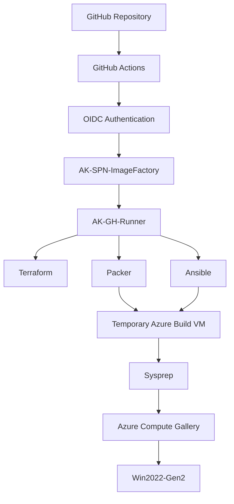
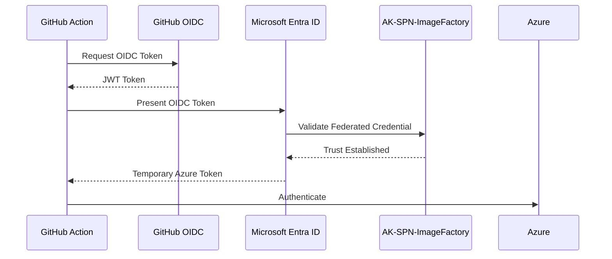
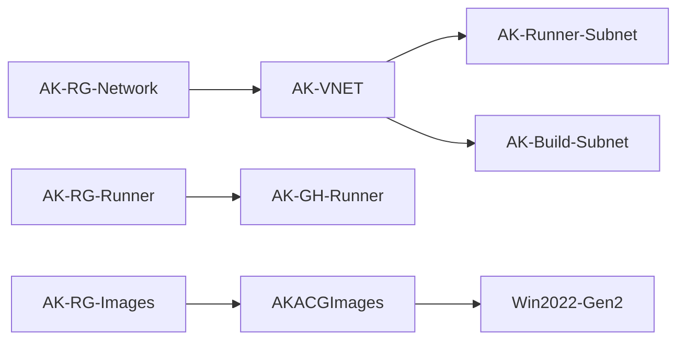
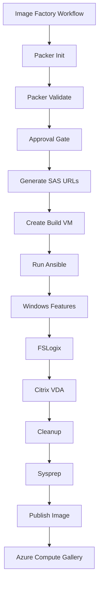

# Azure Image Factory - Complete Knowledge Transfer Guide

## Purpose
This document is a complete KT guide for building and operating the Azure Image Factory solution using GitHub Actions, OIDC, Terraform, Self-Hosted Runners, Packer, Ansible, Azure Storage, and Azure Compute Gallery.

It is written for engineers with limited prior experience.

---

# Architecture Diagram



---

# OIDC Authentication Sequence



---

# Terraform Dependency Diagram



---

# Image Build Execution Flow



---

# Azure Resources

| Resource Type | Name |
|---------------|------|
| State RG | AK-RG-TFState |
| Network RG | AK-RG-Network |
| Runner RG | AK-RG-Runner |
| Image Factory RG | AK-RG-ImageFactory |
| Image RG | AK-RG-Images |
| VNET | AK-VNET |
| Runner Subnet | AK-Runner-Subnet |
| Build Subnet | AK-Build-Subnet |
| Runner VM | AK-GH-Runner |
| Storage Account | akifsoftware |
| Container | software |
| Gallery | AKACGImages |
| Image Definition | Win2022-Gen2 |
| Service Principal | AK-SPN-ImageFactory |

---

# GitHub Repository Structure

```text
Image_Factory
│
├── terraform
├── packer
│   └── AK-IF.pkr.hcl
├── ansible
│   ├── playbook.yml
│   └── roles
│       ├── windows_features.yml
│       ├── fslogix.yml
│       ├── citrix_vda.yml
│       └── cleanup.yml
├── .github
│   └── workflows
│       ├── terraform.yml
│       └── image_factory.yml
└── README.md
```

---

# Self Hosted Runner

## Machine

AK-GH-Runner

## Installed Components

| Tool | Purpose |
|--------|----------|
| Azure CLI | Azure Authentication |
| Terraform | Infrastructure Deployment |
| Packer | Image Build |
| Python | Ansible Runtime |
| Ansible | Image Configuration |
| pywinrm | WinRM Support |
| requests-ntlm | NTLM Authentication |
| requests-credssp | CredSSP Authentication |

## Runner Labels

```text
self-hosted
Linux
X64
terraform
packer
ansible
imagefactory
```

---

# Storage Design

Storage Account:

```text
akifsoftware
```

Container:

```text
software
```

Files:

```text
FSLogixAppsSetup.exe
VDAServerSetup_2603.exe
```

Container is private.

---

# Runtime SAS Design

Old Approach:

```text
Hardcoded SAS
```

Problems:

- Long-lived
- Security Risk
- Expiry Issues

New Approach:

```text
Approval
↓
Generate SAS
↓
Mask Values
↓
Packer Build
```

Benefits:

- Generated only when needed
- No secrets in GitHub
- Reduced exposure window

---

# Packer Responsibilities

Packer is responsible for:

```text
Create Build VM
Enable WinRM
Run Ansible
Run Sysprep
Capture Image
Publish Gallery Version
```

---

# Ansible Responsibilities

## windows_features.yml

Installs:

```text
RDS-RD-Server
Server-Media-Foundation
```

## fslogix.yml

```text
Download FSLogix
Install FSLogix
Validate Installation
```

## citrix_vda.yml

```text
Download Citrix VDA
Install Citrix
Collect Logs
Validate Components
```

## cleanup.yml

```text
Pause (optional)
Remove Temporary Files
```

---

# Build Verification Paths

## Check Image Version

```text
Azure Portal
→ AK-RG-Images
→ AKACGImages
→ Win2022-Gen2
→ Versions
```

## Create Test VM

```text
Azure Portal
→ Azure Compute Gallery
→ AKACGImages
→ Win2022-Gen2
→ Version
→ Create VM
```

---

# Troubleshooting Guide

| Error | Cause | Resolution |
|---------|---------|------------|
| AADSTS700213 | Missing federated credential | Create matching Environment credential |
| QuotaExceeded | VM family quota unavailable | Change VM size or request quota |
| No module named winrm | Missing WinRM dependency | Install pywinrm packages |
| Unset variable fslogix_url | Validation missing vars | Pass placeholder values |
| ResourceNotFound VNET | Dependency issue | Fix Terraform references |
| Relative URI | Empty installer URL | Verify variable propagation |

---

# Lessons Learned

## 1. OIDC Environment Subjects Matter

GitHub changes the OIDC subject when using Environments.

Example:

```text
repo:akumar2oo2/Image_Factory:environment:production
```

A matching federated credential must exist.

---

## 2. Self Hosted Runners Simplify Tooling

Benefits observed:

- No Terraform installation each run
- Faster execution
- Packer and Ansible pre-installed

---

## 3. Generate SAS After Approval

Generating SAS before approval caused:

- Expiration risks
- Output passing complications

Final approach:

```text
Approval
↓
Generate SAS
↓
Build
```

---

## 4. Packer Validation Still Requires Variables

Even if variables are unused during validation:

```text
fslogix_url
citrix_url
```

must still be provided.

---

## 5. Azure Quotas Matter

Packer VM creation can fail even with correct code.

Always verify:

```text
Subscription
→ Usage + Quotas
```

before troubleshooting code.

---

## 6. WinRM Must Exist In Runner Service Context

Installing a Python package for the SSH user does not always mean the runner service can access it.

Verify:

```bash
python3 -c "import winrm"
```

---

# Operational Runbook

## Deploy Infrastructure

```text
GitHub
→ Terraform Workflow
→ Apply
→ Approval
→ Execute
```

## Build Image

```text
GitHub
→ Image Factory Workflow
→ Validate
→ Approval
→ Build
```

## Verify Runner

```text
GitHub
→ Settings
→ Actions
→ Runners
→ AK-GH-Runner
```

## Verify Image

```text
Azure Portal
→ AKACGImages
→ Win2022-Gen2
→ Versions
```

---

# Final Outcome

The completed platform provides:

- GitHub Actions
- OIDC Authentication
- Self Hosted Runner
- Terraform Infrastructure Automation
- Packer Image Automation
- Ansible Configuration Automation
- Runtime SAS Security
- Azure Compute Gallery Publishing
- Approval Gates
- Secret-Free Azure Authentication

This solution provides a repeatable enterprise-grade image factory platform.
