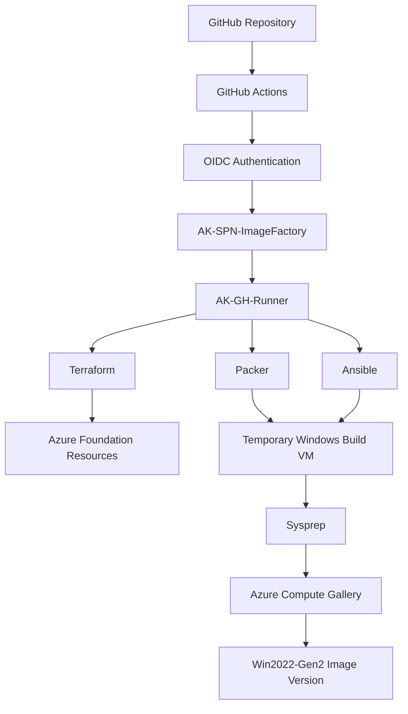
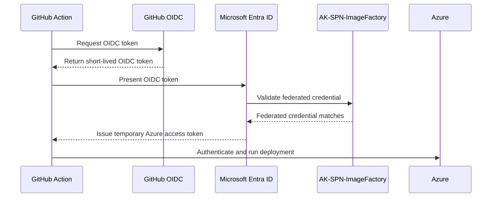
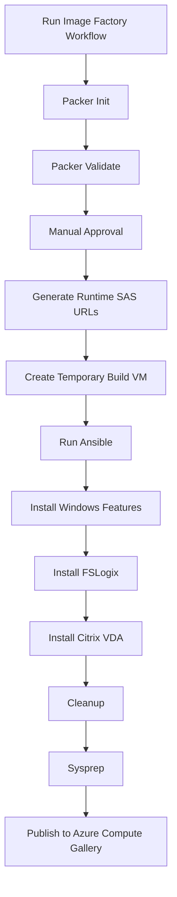

# Azure Image Factory - End-to-End Knowledge Transfer Guide

## 1. Executive Summary

This README is a complete Knowledge Transfer document for the Azure Image Factory built in the `akumar2oo2/Image_Factory` GitHub repository.

The solution automates the creation of Windows golden images using Terraform, GitHub Actions, OIDC authentication, a self-hosted GitHub runner, Packer, Ansible, Azure Storage, and Azure Compute Gallery.

The goal of this implementation is to follow an enterprise-style pattern even though the environment is a personal lab. The final design avoids long-lived secrets, keeps Terraform state remote, uses approval gates for destructive or image-building actions, keeps build infrastructure private where possible, and separates responsibilities clearly across Terraform, Packer, Ansible, and GitHub Actions.

---

## 2. What This Platform Does

The Image Factory performs the following high-level activities:

1. Uses Terraform to deploy Azure foundation resources.
2. Uses GitHub Actions with OIDC to authenticate to Azure without client secrets.
3. Uses Azure Storage to store software installers such as FSLogix and Citrix VDA.
4. Uses a self-hosted GitHub runner to execute Terraform, Packer, and Ansible workloads.
5. Uses Packer to create a temporary Windows Server build VM.
6. Uses Ansible to configure the Windows build VM.
7. Installs Windows features, FSLogix, Citrix VDA, and supporting components.
8. Runs Sysprep.
9. Publishes the final image into Azure Compute Gallery.

---

## 3. Final Architecture

```text
GitHub Repository: akumar2oo2/Image_Factory
        |
        v
GitHub Actions Workflows
        |
        v
OIDC Authentication
        |
        v
AK-SPN-ImageFactory
        |
        v
AK-GH-Runner Self-Hosted Runner
        |
        |-- Terraform deploys Azure foundation
        |-- Packer creates temporary image build VM
        |-- Ansible configures Windows image
        |
        v
Azure Compute Gallery: AKACGImages
        |
        v
Image Definition: Win2022-Gen2
        |
        v
Image Versions: 1.0.0, 1.0.1, 1.0.2, etc.
```

---

## 4. Simple Architecture Diagram



---

## 5. Important Azure Portal Paths / Instructions

This section lists the most important Azure Portal paths used in this Image Factory implementation. These paths help with setup, validation, troubleshooting, and day-to-day operations.

---

### 5.1 Terraform State Storage

```text
Azure Portal
→ Resource Groups
→ AK-RG-TFState
→ Storage Account: aksttfstate
→ Containers
→ tfstate
→ imagefactory.tfstate
```

Purpose:

```text
Stores Terraform remote state.
Prevents local state file usage.
Supports state locking.
Allows Terraform workflows to track deployed Azure resources safely.
```

Important note:

```text
AK-RG-TFState, aksttfstate, and the tfstate container are bootstrap resources.
They are created manually before running Terraform because Terraform needs the backend to already exist.
```

---

### 5.2 Network Resources

```text
Azure Portal
→ Resource Groups
→ AK-RG-Network
→ AK-VNET
→ Subnets
```

Expected subnets:

```text
AK-Runner-Subnet
AK-Build-Subnet
```

Purpose:

```text
AK-Runner-Subnet hosts the self-hosted GitHub runner VM.
AK-Build-Subnet hosts temporary Packer image build VMs.
```

Important note:

```text
The self-hosted runner and the temporary Packer build VM are placed in the same VNET so the runner can communicate with the build VM privately.
```

---

### 5.3 Runner VM

```text
Azure Portal
→ Resource Groups
→ AK-RG-Runner
→ Virtual Machine
→ AK-GH-Runner
```

Purpose:

```text
Runs GitHub Actions jobs for Terraform, Packer, and Ansible.
```

Important checks:

```text
VM status should be Running when workflows need to execute.
If the VM is stopped or deallocated, GitHub Actions jobs targeting the self-hosted runner will remain queued.
```

---

### 5.4 Image Factory Build Resources

```text
Azure Portal
→ Resource Groups
→ AK-RG-ImageFactory
```

Purpose:

```text
Packer temporarily creates VM, NIC, disk, and related build resources here.
These resources are expected to be cleaned up automatically after build completion.
```

Important note:

```text
During an active image build, temporary Packer resources may appear in this resource group.
After a successful build, these temporary resources should be removed automatically by Packer.
```

---

### 5.5 Azure Compute Gallery

```text
Azure Portal
→ Resource Groups
→ AK-RG-Images
→ Azure Compute Gallery
→ AKACGImages
→ Image Definitions
→ Win2022-Gen2
→ Versions
```

Purpose:

```text
Stores final golden image versions.
```

Expected result after a successful image build:

```text
A new image version appears under:
AKACGImages → Win2022-Gen2 → Versions
```

Example image versions:

```text
1.0.0
1.0.1
1.0.2
```

---

### 5.6 Software Installer Storage

```text
Azure Portal
→ Resource Groups
→ AK-RG-ImageFactory
→ Storage Account
→ akifsoftware
→ Containers
→ software
```

Expected files:

```text
FSLogixAppsSetup.exe
VDAServerSetup_2603.exe
```

Purpose:

```text
Stores large software installers outside GitHub.
Pipeline generates short-lived SAS URLs at runtime to download these installers.
```

Important note:

```text
The storage container should remain private.
Installers are accessed through runtime-generated SAS URLs created by the Image Factory workflow.
```

---

### 5.7 Service Principal / OIDC

```text
Azure Portal
→ Microsoft Entra ID
→ App registrations
→ All applications
→ AK-SPN-ImageFactory
→ Certificates & secrets
→ Federated credentials
```

Purpose:

```text
This is where GitHub OIDC trust is configured.
The federated credentials allow GitHub Actions workflows to authenticate to Azure without using client secrets.
```

Expected federated credentials:

```text
AK-GitHub-OIDC
→ Used by workflows or jobs that run from the main branch without a GitHub Environment
→ GitHub Branch: main
→ Subject:
  repo:akumar2oo2/Image_Factory:ref:refs/heads/main

AK-GitHubEnv-OIDC
→ Used by Terraform workflow execution job
→ GitHub Environment: production
→ Subject:
  repo:akumar2oo2/Image_Factory:environment:production

AK-GitHubImageFactory-OIDC
→ Used by Image Factory workflow build job
→ GitHub Environment: imagefactory
→ Subject:
  repo:akumar2oo2/Image_Factory:environment:imagefactory
```

Important note:

```text
The federated credential subject must match the GitHub branch or GitHub environment exactly.

Azure does not match authentication based on the federated credential name.

Azure matches based on:
Issuer
Subject
Audience

That is why each GitHub execution pattern needs its own matching federated credential.
```

Example subjects:

```text
repo:akumar2oo2/Image_Factory:ref:refs/heads/main
repo:akumar2oo2/Image_Factory:environment:production
repo:akumar2oo2/Image_Factory:environment:imagefactory
```

---

### 5.8 How to Create the Service Principal / App Registration

```text
Azure Portal
→ Microsoft Entra ID
→ App registrations
→ New registration
```

Use the following values:

```text
Name                    : AK-SPN-ImageFactory
Supported account types : Accounts in this organizational directory only
Redirect URI            : Leave blank
```

After creation, open:

```text
Azure Portal
→ Microsoft Entra ID
→ App registrations
→ All applications
→ AK-SPN-ImageFactory
→ Overview
```

Copy these values:

```text
Application (client) ID
Directory (tenant) ID
```

These values are added in GitHub as repository secrets:

```text
AZURE_CLIENT_ID
AZURE_TENANT_ID
```

Subscription ID is copied from:

```text
Azure Portal
→ Subscriptions
→ Azure subscription 1
→ Overview
→ Subscription ID
```

This value is added in GitHub as:

```text
AZURE_SUBSCRIPTION_ID
```

Important note:

```text
Do not create a client secret for this implementation.
Authentication is handled through GitHub OIDC federated credentials.
```

---

### 5.9 Role Assignments

Role assignments are required so `AK-SPN-ImageFactory` can deploy infrastructure, manage Terraform state, and generate runtime SAS URLs for installers.

---

#### Initial Subscription-Level Role Assignment

```text
Azure Portal
→ Subscriptions
→ Azure subscription 1
→ Access control (IAM)
→ Add role assignment
```

Use the following values:

```text
Role             : Contributor
Assign access to : User, group, or service principal
Member           : AK-SPN-ImageFactory
```

Purpose:

```text
This role is required during the initial bootstrap because Terraform needs permission to create resource groups, networking, Azure Compute Gallery, and other foundation resources.

After the platform is stable, this can later be reduced to resource-group-level permissions.
```

---

#### Terraform State Storage Role Assignment

```text
Azure Portal
→ Resource Groups
→ AK-RG-TFState
→ Storage Account
→ aksttfstate
→ Access control (IAM)
→ Add role assignment
```

Use the following values:

```text
Role   : Storage Blob Data Contributor
Member : AK-SPN-ImageFactory
```

Purpose:

```text
Allows Terraform to read, write, and lock the remote state file stored in the tfstate container.
```

---

#### Installer Storage Role Assignment

```text
Azure Portal
→ Resource Groups
→ AK-RG-ImageFactory
→ Storage Account
→ akifsoftware
→ Access control (IAM)
→ Add role assignment
```

Use the following values:

```text
Role   : Storage Blob Data Contributor
Member : AK-SPN-ImageFactory
```

Purpose:

```text
Allows the Image Factory workflow to generate runtime SAS URLs for installer blobs such as FSLogixAppsSetup.exe and VDAServerSetup_2603.exe.
```

---

#### Expected Role Assignment Summary

| Scope | Role | Principal | Purpose |
|---|---|---|---|
| Subscription | Contributor | AK-SPN-ImageFactory | Initial Terraform deployment |
| `aksttfstate` Storage Account | Storage Blob Data Contributor | AK-SPN-ImageFactory | Terraform remote state access |
| `akifsoftware` Storage Account | Storage Blob Data Contributor | AK-SPN-ImageFactory | Runtime SAS generation for installers |

---

### 5.10 GitHub Secrets Mapping

```text
GitHub
→ akumar2oo2/Image_Factory
→ Settings
→ Secrets and variables
→ Actions
→ Repository secrets
```

Expected secrets:

| GitHub Secret | Azure Source | Purpose |
|---|---|---|
| `AZURE_CLIENT_ID` | AK-SPN-ImageFactory → Application client ID | Used by Azure Login action |
| `AZURE_TENANT_ID` | AK-SPN-ImageFactory → Directory tenant ID | Used by Azure Login action |
| `AZURE_SUBSCRIPTION_ID` | Azure Subscription → Subscription ID | Used by Azure Login action and Packer |
| `WINRM_PASSWORD` | Manually created value | Used by Packer to connect to the temporary Windows build VM |

Important note:

```text
There is no AZURE_CLIENT_SECRET because this solution uses OIDC.
```

---

## 6. Important GitHub Paths / Instructions

This section explains the important GitHub paths used in this project, including the repository, workflows, secrets, environments, and self-hosted runner configuration.

---

### 6.1 Repository

```text
GitHub
→ akumar2oo2
→ Image_Factory
```

Purpose:

```text
This is the main source repository for the Azure Image Factory project.

It contains:
- Terraform code
- Packer code
- Ansible code
- GitHub Actions workflows
- README documentation
```

Expected repository structure:

```text
Image_Factory
│
├── terraform
├── packer
├── ansible
├── .github
│   └── workflows
│       ├── terraform.yml
│       └── image_factory.yml
└── README.md
```

---

### 6.2 GitHub Actions Workflows

```text
GitHub
→ Image_Factory
→ Actions
```

Expected workflows:

```text
Terraform
Image Factory
```

Purpose:

```text
GitHub Actions is used to run infrastructure deployment and image build automation.
```

Workflow summary:

| Workflow | File Path | Purpose |
|---|---|---|
| Terraform | `.github/workflows/terraform.yml` | Deploys or destroys Azure foundation infrastructure |
| Image Factory | `.github/workflows/image_factory.yml` | Builds Windows golden images using Packer and Ansible |

---

### 6.3 Terraform Workflow

Path:

```text
GitHub
→ Image_Factory
→ Actions
→ Terraform
```

Workflow file:

```text
.github/workflows/terraform.yml
```

Purpose:

```text
Used to provision or destroy Azure foundation resources using Terraform.
```

Terraform workflow actions:

```text
apply
destroy
```

Terraform workflow uses:

```text
GitHub OIDC
AK-SPN-ImageFactory
Terraform remote backend
production GitHub Environment approval gate
Self-hosted runner
```

Approval environment:

```text
production
```

Expected flow:

```text
Run workflow
        ↓
Select apply or destroy
        ↓
Terraform Init
        ↓
Terraform Validate
        ↓
Terraform Plan
        ↓
Manual approval through production environment
        ↓
Terraform Apply approved plan
```

---

### 6.4 Image Factory Workflow

Path:

```text
GitHub
→ Image_Factory
→ Actions
→ Image Factory
```

Workflow file:

```text
.github/workflows/image_factory.yml
```

Purpose:

```text
Used to build Windows golden images using Packer and Ansible.
```

Image Factory workflow uses:

```text
GitHub OIDC
AK-SPN-ImageFactory
Self-hosted runner
Packer
Ansible
Runtime SAS generation
imagefactory GitHub Environment approval gate
Azure Compute Gallery
```

Approval environment:

```text
imagefactory
```

Expected flow:

```text
Run workflow
        ↓
Enter image version
        ↓
Packer Init
        ↓
Packer Validate
        ↓
Manual approval through imagefactory environment
        ↓
Generate runtime SAS URLs
        ↓
Packer Build
        ↓
Ansible configuration
        ↓
Sysprep
        ↓
Publish image to Azure Compute Gallery
```

---

### 6.5 GitHub Secrets

```text
GitHub
→ Image_Factory
→ Settings
→ Secrets and variables
→ Actions
→ Repository secrets
```

Required secrets:

| Secret Name | Purpose |
|---|---|
| `AZURE_CLIENT_ID` | Client ID of `AK-SPN-ImageFactory` |
| `AZURE_TENANT_ID` | Azure tenant ID |
| `AZURE_SUBSCRIPTION_ID` | Azure subscription ID |
| `WINRM_PASSWORD` | Password used by Packer to connect to the temporary Windows build VM over WinRM |

Important note:

```text
There is no Azure client secret because the solution uses OIDC.

Do not create or store:
- AZURE_CLIENT_SECRET
- Service Principal password
- Long-lived SAS token
```

Secret source mapping:

| GitHub Secret | Source |
|---|---|
| `AZURE_CLIENT_ID` | Azure Portal → Microsoft Entra ID → App registrations → AK-SPN-ImageFactory → Overview → Application client ID |
| `AZURE_TENANT_ID` | Azure Portal → Microsoft Entra ID → App registrations → AK-SPN-ImageFactory → Overview → Directory tenant ID |
| `AZURE_SUBSCRIPTION_ID` | Azure Portal → Subscriptions → Azure subscription 1 → Overview → Subscription ID |
| `WINRM_PASSWORD` | Manually defined secure password used by Packer |

---

### 6.6 GitHub Environments

```text
GitHub
→ Image_Factory
→ Settings
→ Environments
```

Expected environments:

| Environment | Purpose |
|---|---|
| `production` | Approval gate for Terraform apply or destroy |
| `imagefactory` | Approval gate for Packer image build |

Purpose:

```text
GitHub Environments provide manual approval gates before sensitive operations.

The production environment protects infrastructure changes.
The imagefactory environment protects golden image builds.
```

Important note:

```text
Each GitHub Environment used with OIDC must have a matching Azure federated credential.

If a workflow job uses:
environment: production

Azure expects:
repo:akumar2oo2/Image_Factory:environment:production

If a workflow job uses:
environment: imagefactory

Azure expects:
repo:akumar2oo2/Image_Factory:environment:imagefactory
```

---

### 6.7 GitHub OIDC Relationship

GitHub OIDC is configured through Azure federated credentials.

Azure path:

```text
Azure Portal
→ Microsoft Entra ID
→ App registrations
→ AK-SPN-ImageFactory
→ Certificates & secrets
→ Federated credentials
```

Expected federated credentials:

| Federated Credential | GitHub Scope | Used By |
|---|---|---|
| `AK-GitHub-OIDC` | `main` branch | Jobs that run from main branch without GitHub Environment |
| `AK-GitHubEnv-OIDC` | `production` environment | Terraform workflow execution job |
| `AK-GitHubImageFactory-OIDC` | `imagefactory` environment | Image Factory build job |

Subjects:

```text
AK-GitHub-OIDC
repo:akumar2oo2/Image_Factory:ref:refs/heads/main

AK-GitHubEnv-OIDC
repo:akumar2oo2/Image_Factory:environment:production

AK-GitHubImageFactory-OIDC
repo:akumar2oo2/Image_Factory:environment:imagefactory
```

Important note:

```text
Azure does not authenticate based on the federated credential name.

Azure matches based on:
- Issuer
- Subject
- Audience

The subject must match the GitHub workflow execution context exactly.
```

---

### 6.8 GitHub Self-Hosted Runner

```text
GitHub
→ Image_Factory
→ Settings
→ Actions
→ Runners
→ AK-GH-Runner
```

Expected runner:

```text
AK-GH-Runner
```

Expected status when idle:

```text
Idle
```

Expected status when running a workflow:

```text
Active
```

Expected runner labels:

```text
self-hosted
Linux
X64
terraform
packer
ansible
imagefactory
```

Purpose:

```text
The self-hosted runner executes Terraform, Packer, and Ansible workflows from inside the Azure environment.
```

Why this runner is used:

```text
Tools are already installed.
Pipeline execution is faster.
The runner can reach private Azure resources.
The build environment is controlled.
Troubleshooting is easier through SSH access.
```

---

### 6.9 Workflow Runner Selection

Terraform workflow should use labels similar to:

```yaml
runs-on:
  - self-hosted
  - Linux
  - X64
  - terraform
```

Image Factory workflow should use labels similar to:

```yaml
runs-on:
  - self-hosted
  - Linux
  - X64
  - packer
  - ansible
```

Purpose:

```text
Labels ensure that GitHub selects a runner with the required tools for the workflow.
```

Important note:

```text
If the runner is offline, GitHub Actions jobs using self-hosted labels will remain queued.
```

---

### 6.10 GitHub Actions Run History

Terraform run history:

```text
GitHub
→ Image_Factory
→ Actions
→ Terraform
→ Workflow run
```

Image Factory run history:

```text
GitHub
→ Image_Factory
→ Actions
→ Image Factory
→ Workflow run
```

Use run history to check:

```text
Workflow trigger input
Runner used
Azure Login status
Terraform plan or apply logs
Packer validate logs
Packer build logs
Ansible task logs
Failure messages
Approval history
```

---

### 6.11 GitHub Approval Path

When a workflow reaches an environment approval gate:

```text
GitHub
→ Image_Factory
→ Actions
→ Current workflow run
→ Review deployments
```

Approve the deployment for:

```text
production
```

or:

```text
imagefactory
```

depending on the workflow.

Purpose:

```text
Prevents infrastructure changes or image builds from running without human approval.
```

---

### 6.12 GitHub Repository Files to Check During Troubleshooting

Terraform workflow file:

```text
.github/workflows/terraform.yml
```

Image Factory workflow file:

```text
.github/workflows/image_factory.yml
```

Terraform root module:

```text
terraform/main.tf
terraform/providers.tf
terraform/backend.tf
terraform/variables.tf
terraform/terraform.tfvars
```

Packer template:

```text
packer/AK-IF.pkr.hcl
```

Ansible playbook:

```text
ansible/playbook.yml
```

Ansible task files:

```text
ansible/roles/windows_features.yml
ansible/roles/fslogix.yml
ansible/roles/citrix_vda.yml
ansible/roles/cleanup.yml
```

README:

```text
README.md
```

---

### 6.13 GitHub Operational Checklist

Before running Terraform workflow:

| Check | Expected |
|---|---|
| `AK-GH-Runner` status | Idle |
| `AZURE_CLIENT_ID` secret | Exists |
| `AZURE_TENANT_ID` secret | Exists |
| `AZURE_SUBSCRIPTION_ID` secret | Exists |
| `production` environment | Exists |
| `AK-GitHubEnv-OIDC` federated credential | Exists |

Before running Image Factory workflow:

| Check | Expected |
|---|---|
| `AK-GH-Runner` status | Idle |
| `WINRM_PASSWORD` secret | Exists |
| `imagefactory` environment | Exists |
| `AK-GitHubImageFactory-OIDC` federated credential | Exists |
| `akifsoftware/software` container | Contains required installers |
| `AKACGImages` gallery | Exists |
| `Win2022-Gen2` image definition | Exists |

---

### 6.14 Common GitHub Issues

| Issue | Common Cause | Fix |
|---|---|---|
| Workflow stuck in queued state | Self-hosted runner is offline | Start `AK-GH-Runner` VM and verify runner service |
| Azure Login fails with `AADSTS700213` | Missing or incorrect federated credential | Create matching OIDC federated credential |
| Approval not appearing | GitHub Environment not configured | Create `production` or `imagefactory` environment |
| Secrets not found | GitHub secret missing or misnamed | Recreate secret with exact expected name |
| Wrong runner selected | Labels mismatch | Update `runs-on` labels or runner labels |
| Image build fails after approval | Installer, Packer, Ansible, or quota issue | Review Image Factory workflow logs |

---

### 6.15 GitHub Section Summary

GitHub is responsible for:

```text
Source control
Workflow execution
OIDC token issuance
Approval gates
Secrets storage
Self-hosted runner management
Pipeline logs
```

Azure is responsible for:

```text
Identity validation
Role-based access control
Infrastructure hosting
Image storage
Runtime resource deployment
```

The integration between GitHub and Azure is handled through:

```text
GitHub OIDC
AK-SPN-ImageFactory
Federated credentials
GitHub repository secrets
GitHub environments
```

---

## 7. Important Runner VM Paths / Instructions

This section explains how to connect to the GitHub self-hosted runner VM, install all required tools, register the GitHub runner, install it as a service, and verify that the runner is ready to execute Terraform, Packer, and Ansible workflows.

The runner VM used in this project is:

```text
Runner VM:
AK-GH-Runner

Runner User:
githubrunner

Runner Purpose:
Executes GitHub Actions workflows for Terraform, Packer, and Ansible.
```

---

### 7.1 Connect to the Runner VM Using SSH

Use the private key downloaded during VM creation.

Generic command:

```bash
ssh -i <private-key-file> githubrunner@<runner-public-ip>
```

Example:

```bash
ssh -i ./AK-GH-Runner-key.pem githubrunner@20.XXX.XX.XX
```

After successful login, the terminal prompt should look similar to:

```bash
githubrunner@AK-GH-Runner:~$
```

---

### 7.2 Important Runner VM Paths

Runner user home directory:

```text
/home/githubrunner
```

GitHub runner installation directory:

```text
/home/githubrunner/actions-runner
```

GitHub Actions working directory:

```text
/home/githubrunner/actions-runner/_work
```

Repository workspace during workflow execution:

```text
/home/githubrunner/actions-runner/_work/Image_Factory/Image_Factory
```

Terraform code path during workflow execution:

```text
/home/githubrunner/actions-runner/_work/Image_Factory/Image_Factory/terraform
```

Packer code path during workflow execution:

```text
/home/githubrunner/actions-runner/_work/Image_Factory/Image_Factory/packer
```

Ansible code path during workflow execution:

```text
/home/githubrunner/actions-runner/_work/Image_Factory/Image_Factory/ansible
```

---

### 7.3 Update Ubuntu Packages

After connecting to the runner VM, update the package index and upgrade installed packages.

```bash
sudo apt update
sudo apt upgrade -y
```

Purpose:

```text
This prepares the Ubuntu runner VM before installing Azure CLI, Terraform, Packer, Python, Ansible, and GitHub runner dependencies.
```

---

### 7.4 Install Base Utilities

Install common command-line tools required by the runner and workflows.

```bash
sudo apt install -y curl wget git jq unzip zip
```

Verify Git installation:

```bash
git --version
```

Expected result:

```text
git version <version-number>
```

Purpose of installed utilities:

| Tool | Purpose |
|---|---|
| `curl` | Download scripts and packages |
| `wget` | Download Terraform and Packer binaries |
| `git` | Source control operations |
| `jq` | JSON parsing from CLI output |
| `unzip` | Extract Terraform and Packer zip packages |
| `zip` | Archive utility if needed later |

---

### 7.5 Install Azure CLI

Azure CLI is required because GitHub Actions authenticates to Azure using OIDC, and Packer reuses the Azure CLI authenticated session.

Install Azure CLI:

```bash
curl -sL https://aka.ms/InstallAzureCLIDeb | sudo bash
```

Verify Azure CLI:

```bash
az version
```

Purpose:

```text
Azure CLI is used by GitHub Actions, Terraform, and Packer to interact with Azure resources.
```

---

### 7.6 Install Terraform

Terraform is used to deploy Azure foundation resources such as resource groups, VNET, subnets, storage, and Azure Compute Gallery resources.

Go to the home directory:

```bash
cd ~
```

Download Terraform:

```bash
wget https://releases.hashicorp.com/terraform/1.15.7/terraform_1.15.7_linux_amd64.zip
```

Extract Terraform:

```bash
unzip terraform_1.15.7_linux_amd64.zip
```

Move the Terraform binary to the system path:

```bash
sudo mv terraform /usr/local/bin/
```

Verify Terraform:

```bash
terraform version
```

Expected result:

```text
Terraform v1.15.7
```

Purpose:

```text
Terraform is used by the terraform.yml GitHub Actions workflow to deploy or destroy Azure infrastructure.
```

---

### 7.7 Install Packer

Packer is used to create the Windows golden image and publish it to Azure Compute Gallery.

Go to the home directory:

```bash
cd ~
```

Download Packer:

```bash
wget https://releases.hashicorp.com/packer/1.15.4/packer_1.15.4_linux_amd64.zip
```

Extract Packer:

```bash
unzip packer_1.15.4_linux_amd64.zip
```

Move the Packer binary to the system path:

```bash
sudo mv packer /usr/local/bin/
```

Verify Packer:

```bash
packer version
```

Expected result:

```text
Packer v1.15.4
```

Purpose:

```text
Packer is used by the image_factory.yml workflow to create the temporary Windows build VM, run Ansible, run Sysprep, and publish the final image to Azure Compute Gallery.
```

---

### 7.8 Install Python and Pip

Python is required because Ansible runs on Python.

Install Python and Pip:

```bash
sudo apt install -y python3 python3-pip
```

Verify Python:

```bash
python3 --version
```

Verify Pip:

```bash
pip3 --version
```

Purpose:

```text
Python and Pip are required to install and run Ansible and its WinRM dependencies.
```

---

### 7.9 Install Ansible and WinRM Dependencies

Ansible is used to configure the temporary Windows build VM created by Packer.

Install Ansible and required Windows connection dependencies:

```bash
python3 -m pip install --user --break-system-packages ansible pywinrm requests-ntlm requests-credssp
```

Add the user-level Python binary path to `.bashrc`:

```bash
echo 'export PATH=$HOME/.local/bin:$PATH' >> ~/.bashrc
```

Reload shell configuration:

```bash
source ~/.bashrc
```

Verify Ansible:

```bash
ansible --version
```

Verify WinRM dependency:

```bash
python3 -c "import winrm"
```

If the command returns no output, the WinRM module is installed correctly.

Verify NTLM dependency:

```bash
python3 -c "import requests_ntlm"
```

Verify CredSSP dependency:

```bash
python3 -c "import requests_credssp"
```

If the commands return no output, the modules are installed correctly.

Purpose:

```text
pywinrm, requests-ntlm, and requests-credssp are required because Ansible connects to the Windows build VM over WinRM.
```

---

### 7.10 Install Ansible Windows Collections

Install the Ansible collections required for Windows automation.

```bash
ansible-galaxy collection install ansible.windows
```

```bash
ansible-galaxy collection install community.windows
```

Verify installed collections:

```bash
ansible-galaxy collection list
```

Expected collections:

```text
ansible.windows
community.windows
```

Purpose:

```text
These collections provide Windows modules such as win_file, win_get_url, win_package, win_feature, win_reboot, and win_shell.
```

---

### 7.11 Install WinRM Dependencies System-Wide If Required

Sometimes the GitHub runner service may not see packages installed only for the `githubrunner` user.

If the pipeline fails with this error:

```text
No module named winrm
```

install the WinRM packages system-wide:

```bash
sudo python3 -m pip install --break-system-packages pywinrm requests-ntlm requests-credssp
```

Restart the GitHub runner service:

```bash
cd ~/actions-runner
sudo ./svc.sh stop
sudo ./svc.sh start
```

Check runner service status:

```bash
sudo ./svc.sh status
```

Expected result:

```text
active (running)
```

---

### 7.12 Register the GitHub Self-Hosted Runner

Go to GitHub:

```text
GitHub
→ akumar2oo2/Image_Factory
→ Settings
→ Actions
→ Runners
→ New self-hosted runner
→ Linux
→ x64
```

GitHub will show commands similar to the following.

Create the runner directory:

```bash
mkdir actions-runner
cd actions-runner
```

Download the runner package:

```bash
curl -o actions-runner-linux-x64.tar.gz -L <github-runner-download-url>
```

Extract the runner package:

```bash
tar xzf ./actions-runner-linux-x64.tar.gz
```

Configure the runner:

```bash
./config.sh --url https://github.com/akumar2oo2/Image_Factory --token <registration-token>
```

During configuration, use the following values:

```text
Runner group:
Default

Runner name:
AK-GH-Runner

Additional labels:
terraform,packer,ansible,imagefactory

Work folder:
_work
```

Expected labels after registration:

```text
self-hosted
Linux
X64
terraform
packer
ansible
imagefactory
```

Important note:

```text
The registration token is generated by GitHub and expires after a short period.
If the token expires, generate a new runner command from GitHub.
```

---

### 7.13 Install GitHub Runner as a Service

Do not run the runner using:

```bash
./run.sh
```

That method keeps the runner active only while the SSH session is open.

Instead, install the runner as a Linux service:

```bash
cd ~/actions-runner
sudo ./svc.sh install
```

Start the runner service:

```bash
sudo ./svc.sh start
```

Check runner service status:

```bash
sudo ./svc.sh status
```

Expected result:

```text
active (running)
```

Purpose:

```text
Installing the runner as a service ensures that the runner keeps working after SSH is closed and starts automatically after VM reboot.
```

---

### 7.14 Verify Runner in GitHub

Go to:

```text
GitHub
→ akumar2oo2/Image_Factory
→ Settings
→ Actions
→ Runners
```

Expected runner:

```text
AK-GH-Runner
```

Expected status when idle:

```text
Idle
```

Expected status when running a workflow:

```text
Active
```

---

### 7.15 Verify Installed Tools

Run these commands on the runner VM:

```bash
az version
terraform version
packer version
ansible --version
python3 --version
```

Expected result:

```text
Azure CLI is installed.
Terraform is installed.
Packer is installed.
Ansible is installed.
Python is installed.
```

Also verify WinRM support:

```bash
python3 -c "import winrm"
python3 -c "import requests_ntlm"
python3 -c "import requests_credssp"
```

Expected result:

```text
No output means the modules are installed correctly.
```

---

### 7.16 Manage Runner Service

Go to the runner directory:

```bash
cd ~/actions-runner
```

Check service status:

```bash
sudo ./svc.sh status
```

Start service:

```bash
sudo ./svc.sh start
```

Stop service:

```bash
sudo ./svc.sh stop
```

Restart service:

```bash
sudo ./svc.sh stop
sudo ./svc.sh start
```

---

### 7.17 What Happens If SSH Is Closed?

If the runner was installed using:

```bash
sudo ./svc.sh install
sudo ./svc.sh start
```

then closing PowerShell or disconnecting SSH does not stop the runner.

Expected behavior:

```text
SSH session closed:
Runner continues working.

VM rebooted:
Runner service starts automatically.

VM stopped or deallocated:
Runner goes offline.

VM started again:
Runner service reconnects automatically after boot.
```

---

### 7.18 Workflow Runner Configuration

GitHub Actions workflows should target this runner using labels.

Terraform workflow example:

```yaml
runs-on:
  - self-hosted
  - Linux
  - X64
  - terraform
```

Image Factory workflow example:

```yaml
runs-on:
  - self-hosted
  - Linux
  - X64
  - packer
  - ansible
```

Purpose:

```text
Labels ensure GitHub selects the correct runner for the correct workload.
```

---

### 7.19 Final Runner Validation Checklist

Before using the runner for Terraform or Image Factory workflows, validate the following:

| Check | Command or Path | Expected Result |
|---|---|---|
| SSH access works | `ssh -i <key> githubrunner@<ip>` | Login succeeds |
| Azure CLI installed | `az version` | Version displayed |
| Terraform installed | `terraform version` | Version displayed |
| Packer installed | `packer version` | Version displayed |
| Python installed | `python3 --version` | Version displayed |
| Ansible installed | `ansible --version` | Version displayed |
| WinRM module installed | `python3 -c "import winrm"` | No output |
| GitHub runner installed | `~/actions-runner` | Directory exists |
| Runner service running | `sudo ./svc.sh status` | active running |
| Runner visible in GitHub | GitHub → Settings → Actions → Runners | AK-GH-Runner visible |

```text
If all checks pass, the runner is ready for Terraform, Packer, and Ansible workflows.
```

## 8. Bootstrap Phase

### 8.1 What Is the Bootstrap Phase?

The bootstrap phase is the minimum setup required before Terraform, Packer, GitHub Actions, and the Image Factory pipeline can operate safely.

Bootstrap resources are created manually because Terraform cannot store state in a backend that does not exist yet.

In this project, bootstrap resources include:

```text
Terraform state storage
Installer storage
Service principal / app registration
OIDC federated credentials
Initial role assignments
GitHub repository secrets
```

These resources must exist before Terraform and the Image Factory workflows can run successfully.

---

### 8.2 Bootstrap Resources

These resources are created manually before Terraform and the Image Factory pipeline can run successfully.

| Resource | Created By | Why |
|---|---|---|
| `AK-RG-TFState` | Manual | Stores Terraform backend resources. This resource group exists outside the main Terraform deployment because Terraform needs the backend before it can run. |
| `aksttfstate` | Manual | Storage account used by Terraform remote backend to store the state file. |
| `tfstate` container | Manual | Blob container where `imagefactory.tfstate` is stored. |
| `akifsoftware` | Manual | Storage account used to store Image Factory software installers such as FSLogix and Citrix VDA. |
| `software` container | Manual | Private blob container inside `akifsoftware` where installer binaries are uploaded. |
| `FSLogixAppsSetup.exe` | Manual Upload | FSLogix installer used by Ansible during image build. |
| `VDAServerSetup_2603.exe` | Manual Upload | Citrix VDA installer used by Ansible during image build. |
| `AK-SPN-ImageFactory` | Manual | App registration/service principal used by GitHub Actions to authenticate to Azure through OIDC. |
| Subscription Contributor role | Manual | Assigned to `AK-SPN-ImageFactory` during bootstrap so Terraform can create the initial resource groups, networking, gallery, and foundation resources. |
| Storage Blob Data Contributor on `aksttfstate` | Manual | Allows Terraform to read, write, and lock the remote state file in Azure Storage. |
| Storage Blob Data Contributor on `akifsoftware` | Manual | Allows the Image Factory pipeline to generate runtime SAS URLs for installer downloads. |
| Federated Credentials | Manual | Allows GitHub workflows to authenticate to Azure without using client secrets. Separate credentials are created for the `main` branch, `production` environment, and `imagefactory` environment. |
| GitHub Secrets | Manual | Stores required identifiers and runtime values such as `AZURE_CLIENT_ID`, `AZURE_TENANT_ID`, `AZURE_SUBSCRIPTION_ID`, and `WINRM_PASSWORD`. |

---

### 8.3 Bootstrap Flow

```text
Create AK-RG-TFState
        ↓
Create aksttfstate Storage Account
        ↓
Create tfstate Container
        ↓
Create akifsoftware Storage Account
        ↓
Create software Container
        ↓
Upload Installer Files
        ├── FSLogixAppsSetup.exe
        └── VDAServerSetup_2603.exe
        ↓
Create AK-SPN-ImageFactory App Registration
        ↓
Assign Contributor role on Subscription for initial Terraform deployment
        ↓
Assign Storage Blob Data Contributor on aksttfstate
        ↓
Assign Storage Blob Data Contributor on akifsoftware
        ↓
Create GitHub OIDC Federated Credentials
        ├── main branch
        ├── production environment
        └── imagefactory environment
        ↓
Create GitHub Repository Secrets
        ├── AZURE_CLIENT_ID
        ├── AZURE_TENANT_ID
        ├── AZURE_SUBSCRIPTION_ID
        └── WINRM_PASSWORD
        ↓
Run Terraform Workflow
        ↓
Deploy Azure foundation resources
        ↓
Run Image Factory Workflow
```

---

### 8.4 Bootstrap Resource Explanation

| Bootstrap Item | Purpose |
|---|---|
| `AK-RG-TFState` | Dedicated resource group for Terraform backend resources. |
| `aksttfstate` | Storage account used by Terraform backend. |
| `tfstate` container | Stores the `imagefactory.tfstate` file. |
| `akifsoftware` | Storage account used to store installers required by the Image Factory workflow. |
| `software` container | Private container where FSLogix and Citrix VDA installers are uploaded. |
| `AK-SPN-ImageFactory` | Identity used by GitHub Actions to authenticate to Azure using OIDC. |
| Subscription Contributor role | Allows initial Terraform deployment to create Azure foundation resources. |
| Storage Blob Data Contributor on `aksttfstate` | Allows Terraform to access and lock the remote state file. |
| Storage Blob Data Contributor on `akifsoftware` | Allows the Image Factory workflow to generate runtime SAS URLs for installer blobs. |
| GitHub Federated Credentials | Allows GitHub workflows to authenticate without client secrets. |
| GitHub Repository Secrets | Stores required values used by GitHub workflows. |

---

### 8.5 Important Bootstrap Notes

```text
The Terraform backend must be created before Terraform can run.
```

```text
The installer storage account must exist before the Image Factory workflow can generate runtime SAS URLs.
```

```text
The service principal must have the required role assignments before GitHub Actions can deploy resources or generate SAS URLs.
```

```text
Each GitHub execution context needs a matching federated credential.
```

For this project, the required OIDC execution contexts are:

```text
main branch
production environment
imagefactory environment
```

---

### 8.6 Why Bootstrap Resources Are Not Fully Managed by Terraform

Terraform requires a backend to store its state.

If Terraform tried to create the storage account that stores its own state, it would create a chicken-and-egg problem:

```text
Terraform needs state storage
        ↓
But state storage does not exist yet
        ↓
Terraform cannot initialize backend
```

Therefore, the Terraform backend resources are created manually first.

After the backend exists, Terraform can safely manage the rest of the Azure infrastructure.

---

### 8.7 Bootstrap Completion Checklist

Before running the Terraform workflow, confirm the following:

| Check | Expected Result |
|---|---|
| `AK-RG-TFState` exists | Resource group is visible in Azure Portal |
| `aksttfstate` exists | Storage account is visible under `AK-RG-TFState` |
| `tfstate` container exists | Container is visible inside `aksttfstate` |
| `akifsoftware` exists | Storage account is visible under `AK-RG-ImageFactory` |
| `software` container exists | Container is visible inside `akifsoftware` |
| Installer files uploaded | `FSLogixAppsSetup.exe` and `VDAServerSetup_2603.exe` exist |
| `AK-SPN-ImageFactory` exists | App registration is visible in Microsoft Entra ID |
| Subscription Contributor assigned | `AK-SPN-ImageFactory` has Contributor on subscription |
| State storage role assigned | `AK-SPN-ImageFactory` has Storage Blob Data Contributor on `aksttfstate` |
| Installer storage role assigned | `AK-SPN-ImageFactory` has Storage Blob Data Contributor on `akifsoftware` |
| OIDC credentials created | Main branch, production, and imagefactory credentials exist |
| GitHub secrets created | Required secrets exist in GitHub repository settings |

If all checks pass, the environment is ready for:

```text
Terraform workflow
Image Factory workflow
```

---

## 9. Why OIDC Is Better Than Client Secrets

### 9.1 Traditional Client Secret Approach

```text
GitHub Secret stores client secret
        ↓
Workflow uses client secret
        ↓
Azure issues token
```

Problems:

| Problem | Impact |
|---|---|
| Secret expiration | Pipeline failure |
| Manual rotation | Operational overhead |
| Secret leakage | Security incident |
| Long-lived credential | Larger attack surface |

In this approach, the pipeline depends on a stored client secret. If the secret expires, is deleted, or is rotated incorrectly, the pipeline fails.

---

### 9.2 OIDC Approach

```text
GitHub workflow requests temporary token
        ↓
Microsoft Entra validates repository, branch, or environment
        ↓
Azure grants short-lived access
```

Benefits:

| Benefit | Explanation |
|---|---|
| No Azure password | No client secret is stored in GitHub |
| Short-lived token | Token exists only during workflow execution |
| Environment scoping | Terraform and image builds use separate GitHub environments |
| Better security | Reduces credential leakage risk |
| Enterprise pattern | Aligns with modern CI/CD security practices |

With OIDC, GitHub Actions does not store an Azure client secret. Instead, GitHub requests a temporary token during workflow execution, and Microsoft Entra ID validates whether that workflow is allowed to authenticate.

---

### 9.3 OIDC Authentication Sequence



Important note:

```text
OIDC authentication succeeds only when the GitHub workflow context matches a federated credential configured on AK-SPN-ImageFactory.

For example:
- main branch jobs require a main branch federated credential.
- production environment jobs require a production environment federated credential.
- imagefactory environment jobs require an imagefactory environment federated credential.
```

---

## 10. Federated Credentials

The app registration used by GitHub Actions workflows is:

```text
AK-SPN-ImageFactory
```

Federated credentials are configured inside this app registration to allow GitHub Actions to authenticate to Azure using OIDC.

---

### 10.1 Why Multiple Federated Credentials Are Required

GitHub sends a different OIDC subject depending on how the workflow job is executed.

For example:

```text
Workflow running from main branch without GitHub Environment
→ repo:akumar2oo2/Image_Factory:ref:refs/heads/main
```

```text
Workflow using production environment
→ repo:akumar2oo2/Image_Factory:environment:production
```

```text
Workflow using imagefactory environment
→ repo:akumar2oo2/Image_Factory:environment:imagefactory
```

Azure requires an exact match between the subject sent by GitHub and the subject configured in the federated credential.

That is why this project uses three federated credentials.

---

### 10.2 Federated Credential for Main Branch

```text
Name:
AK-GitHub-OIDC
```

```text
Used by:
Workflows or jobs that run from the main branch without a GitHub Environment
```

```text
GitHub scope:
Branch: main
```

```text
Subject:
repo:akumar2oo2/Image_Factory:ref:refs/heads/main
```

Purpose:

```text
Allows GitHub Actions jobs running directly from the main branch to authenticate to Azure using OIDC.
```

---

### 10.3 Federated Credential for Terraform Environment

```text
Name:
AK-GitHubEnv-OIDC
```

```text
Used by:
Terraform workflow execution job
```

```text
GitHub Environment:
production
```

```text
Subject:
repo:akumar2oo2/Image_Factory:environment:production
```

Purpose:

```text
Allows the Terraform workflow to authenticate to Azure after the production environment approval gate.
```

This credential is required because the Terraform workflow uses:

```yaml
environment:
  name: production
```

---

### 10.4 Federated Credential for Image Factory Environment

```text
Name:
AK-GitHubImageFactory-OIDC
```

```text
Used by:
Image Factory workflow build job
```

```text
GitHub Environment:
imagefactory
```

```text
Subject:
repo:akumar2oo2/Image_Factory:environment:imagefactory
```

Purpose:

```text
Allows the Image Factory workflow to authenticate to Azure after the imagefactory environment approval gate.
```

This credential is required because the Image Factory workflow uses:

```yaml
environment:
  name: imagefactory
```

---

### 10.5 Federated Credential Summary

| Federated Credential | GitHub Scope | Subject | Used By |
|---|---|---|---|
| `AK-GitHub-OIDC` | Main branch | `repo:akumar2oo2/Image_Factory:ref:refs/heads/main` | Jobs running from main branch without GitHub Environment |
| `AK-GitHubEnv-OIDC` | `production` environment | `repo:akumar2oo2/Image_Factory:environment:production` | Terraform workflow execution job |
| `AK-GitHubImageFactory-OIDC` | `imagefactory` environment | `repo:akumar2oo2/Image_Factory:environment:imagefactory` | Image Factory workflow build job |

---

### 10.6 Important Notes

```text
Azure does not authenticate based on the federated credential name.
```

Azure matches OIDC authentication using:

```text
Issuer
Subject
Audience
```

The federated credential name is only for readability and maintenance.

For this project:

```text
Issuer:
https://token.actions.githubusercontent.com
```

```text
Audience:
api://AzureADTokenExchange
```

The most important field is the subject because it must match the GitHub workflow execution context exactly.

If the subject does not match, Azure login fails with an error similar to:

```text
AADSTS700213:
No matching federated identity record found for presented assertion subject.
```

---

### 10.7 Common Mistake

If the workflow uses this:

```yaml
environment:
  name: production
```

then Azure expects this subject:

```text
repo:akumar2oo2/Image_Factory:environment:production
```

It will not match this branch-based subject:

```text
repo:akumar2oo2/Image_Factory:ref:refs/heads/main
```

Therefore, environment-based jobs need separate environment-based federated credentials.
---

## 11. Why Self-Hosted Runner Is Better Here

### 11.1 GitHub-Hosted Runner Pattern

```text
Start temporary GitHub VM
        ↓
Install tools
        ↓
Run job
        ↓
Delete VM
```

GitHub-hosted runners are useful for many normal CI/CD workloads because they are managed by GitHub and are created fresh for every workflow run.

However, for this Image Factory use case, GitHub-hosted runners are not ideal because the workflow depends on several tools and future private network access.

Limitations:

| Limitation | Impact |
|---|---|
| Tools installed every run | Slower pipeline execution because Terraform, Packer, Ansible, and dependencies may need to be installed repeatedly |
| No private network access by default | Harder to connect to private build VMs inside Azure VNET |
| Less control | Runner image, installed packages, versions, and troubleshooting access are limited |
| Ephemeral VM | The runner is deleted after each job, making troubleshooting and dependency persistence harder |

---

### 11.2 Self-Hosted Runner Pattern

```text
AK-GH-Runner already exists
        ↓
Tools already installed
        ↓
Workflow starts immediately
        ↓
Can access Azure private network
```

In this project, the self-hosted runner is the better choice because it acts as the dedicated execution machine for Terraform, Packer, and Ansible.

Benefits:

| Benefit | Explanation |
|---|---|
| Faster execution | Terraform, Packer, Azure CLI, Ansible, and WinRM dependencies are already installed |
| Private networking | Runner can reach temporary Packer build VMs inside `AK-VNET` |
| Easier troubleshooting | SSH access is available for checking tools, logs, services, and dependencies |
| Better control | VM size, operating system, packages, runner labels, and runtime behavior are controlled directly |
| Enterprise style | Matches typical corporate build architecture where deployment runners are placed inside controlled network boundaries |

---

### 11.3 Why This Matters for Image Factory

The Image Factory workflow is different from a simple application build pipeline.

It needs to:

```text
Run Packer
Connect to Azure
Create a temporary Windows build VM
Connect to the build VM using WinRM
Run Ansible
Download software installers
Publish the final image to Azure Compute Gallery
```

For this type of workload, using a self-hosted runner is more practical because the runner can be prepared once and reused for every image build.

This avoids repeatedly installing large toolchains and makes the image build process more predictable.

---

## 12. Terraform Design

Terraform is responsible for Azure foundation resources.

Terraform creates:

```text
AK-RG-Network
AK-RG-Runner
AK-RG-ImageFactory
AK-RG-Images
AK-VNET
AK-Runner-Subnet
AK-Build-Subnet
AKACGImages
Win2022-Gen2 image definition
```

Terraform does not create:

```text
AK-RG-TFState
aksttfstate
state container
```

Those are bootstrap resources.

### 12.1 Terraform Workflow

```text
GitHub Actions
        ↓
Azure OIDC Login
        ↓
Terraform Init
        ↓
Terraform Validate
        ↓
Terraform Plan
        ↓
Manual Approval
        ↓
Terraform Apply
```

### 12.2 Terraform Remote State

State location:

```text
AK-RG-TFState
→ aksttfstate
→ tfstate
→ imagefactory.tfstate
```

Purpose:

```text
Tracks Azure resources managed by Terraform.
Allows safe updates.
Prevents local state file usage.
Supports locking.
```

---

## 13. Packer Design

Packer is responsible for image lifecycle.

Packer does:

```text
Authenticate using Azure CLI session created by OIDC
Create temporary Windows Server VM
Configure WinRM
Run Ansible
Run Sysprep
Capture image
Publish image to Azure Compute Gallery
Clean up temporary resources
```

Packer file path:

```text
packer/AK-IF.pkr.hcl
```

Final image target:

```text
AK-RG-Images
→ AKACGImages
→ Win2022-Gen2
→ Versions
```

---

## 14. Ansible Design

Ansible handles the Windows configuration inside the temporary build VM.

Ansible entry point:

```text
ansible/playbook.yml
```

Roles:

```text
ansible/roles/windows_features.yml
ansible/roles/fslogix.yml
ansible/roles/citrix_vda.yml
ansible/roles/cleanup.yml
```

Execution order:

```text
Windows Features
        ↓
FSLogix
        ↓
Citrix VDA
        ↓
Cleanup
```

### 14.1 Windows Features

Installs:

```text
RDS-RD-Server
Server-Media-Foundation
```

### 14.2 FSLogix

Tasks:

```text
Create working directory
Download installer
Install FSLogix
Validate installation
```

### 14.3 Citrix VDA

Tasks:

```text
Create working directory
Download VDA installer
Install VDA
Collect precheck logs
Validate required Citrix components
```

### 14.4 Cleanup

Tasks:

```text
Optional pause
Remove FSLogix temporary folder
Remove Citrix temporary folder
```

---

## 15. Software Installer Strategy

Installers are stored in Azure Storage, not GitHub.

Reason:

```text
Installers are large files.
GitHub should not store large binaries.
Azure Storage provides secure central access.
The pipeline can generate short-lived SAS URLs at runtime.
```

Storage path:

```text
Azure Portal
→ AK-RG-ImageFactory
→ akifsoftware
→ Containers
→ software
```

Expected blob names:

```text
FSLogixAppsSetup.exe
VDAServerSetup_2603.exe
```

---

## 16. Runtime SAS Design

### 16.1 Rejected Approach

```text
Hardcoded SAS URL in repository or secrets
```

Problems:

```text
Can expire unexpectedly
Can be exposed accidentally
Requires rotation
Not ideal for enterprise pattern
```

### 16.2 Final Approach

```text
Manual approval
        ↓
Generate SAS inside build job
        ↓
Mask SAS values in logs
        ↓
Pass URL to Packer
        ↓
Ansible downloads installers
```

Benefits:

| Benefit | Explanation |
|---|---|
| Short-lived access | SAS exists only briefly |
| No stored SAS | SAS not committed or stored permanently |
| Better security | SAS is generated after approval |
| Avoids expiry during approval wait | SAS is not generated before manual approval |

---

## 17. GitHub Workflows

### 17.1 Terraform Workflow

Path:

```text
.github/workflows/terraform.yml
```

Purpose:

```text
Deploy or destroy Terraform-managed Azure infrastructure.
```

Actions:

```text
apply
destroy
```

Approval environment:

```text
production
```

---

### 17.2 Image Factory Workflow

Path:

```text
.github/workflows/image_factory.yml
```

Purpose:

```text
Build Windows golden image using Packer and Ansible.
```

Approval environment:

```text
imagefactory
```

Main phases:

```text
Packer Init
Packer Validate
Approval
Generate SAS
Packer Build
Ansible Configuration
Sysprep
Publish Image
```

---

## 18. Image Build Flow



---

## 19. How to Build a New Image

1. Go to GitHub.
2. Open `akumar2oo2/Image_Factory`.
3. Go to `Actions`.
4. Select `Image Factory` workflow.
5. Select `Run workflow`.
6. Enter an image version such as `1.0.1`.
7. Start the workflow.
8. Wait for validation to complete.
9. Approve the `imagefactory` environment deployment.
10. Wait for Packer and Ansible to complete.
11. Verify the new version in Azure Compute Gallery.

---

## 20. Where to Check Final Image

```text
Azure Portal
→ Resource Groups
→ AK-RG-Images
→ AKACGImages
→ Image Definitions
→ Win2022-Gen2
→ Versions
```

Expected result:

```text
Image version appears with Succeeded provisioning state.
```

---

## 21. How to Validate the Image

Create a test VM:

```text
Azure Portal
→ Azure Compute Gallery
→ AKACGImages
→ Win2022-Gen2
→ Select image version
→ Create VM
```

Then check installed applications:

```text
FSLogix
Citrix Virtual Apps and Desktops
Citrix Workspace
Citrix Secure Access Endpoint Analysis
Citrix Workspace Environment Management Agent
deviceTRUST Agent
```

---

## 22. Troubleshooting Guide

| Issue | Symptom | Root Cause | Fix |
|---|---|---|---|
| AADSTS700213 | Azure login fails | Federated credential subject mismatch | Create matching environment credential |
| QuotaExceeded | Packer VM creation fails | VM family quota is zero | Use another VM size or request quota |
| No module named winrm | Ansible fails | pywinrm missing in runner service context | Install pywinrm system-wide |
| Relative URI | FSLogix download fails | URL variable is empty | Validate Packer to Ansible variable passing |
| Unset variable | Packer validate fails | Required variables missing | Pass placeholder installer URLs during validate |
| VNET not found | Subnet creation fails | Terraform dependency issue | Reference VNET resource correctly |
| SAS expired | Download fails with authorization error | SAS generated too early | Generate SAS after approval |

---

## 23. Lessons Learned

### 23.1 OIDC Subject Must Match Exactly

When GitHub uses an environment, the OIDC subject changes to:

```text
repo:akumar2oo2/Image_Factory:environment:<environment-name>
```

Azure must have a matching federated credential.

---

### 23.2 Generate SAS After Approval

Generating SAS before approval caused expiry and output-passing complexity.

Final decision:

```text
Generate SAS only after approval and immediately before image build.
```

---

### 23.3 Self-Hosted Runner Should Run as a Service

Do not use:

```bash
./run.sh
```

Use:

```bash
sudo ./svc.sh install
sudo ./svc.sh start
```

Reason:

```text
Runner continues after SSH session closes.
Runner starts automatically after VM reboot.
```

---

### 23.4 Packer Validate Still Requires Variables

Even if Packer validate does not download installers, it still requires values for variables unless defaults are provided.

Fix:

```text
Use placeholder installer URLs during validation.
```

---

### 23.5 Azure Quota Can Block Correct Code

Packer may fail even when the code is correct if the subscription has no quota for the selected VM family.

Check:

```text
Azure Portal
→ Subscription
→ Usage + quotas
```

---

### 23.6 Runner Python Dependencies Must Be Available to the Service

Installing Python packages using `--user` may not always be visible to the runner service.

For WinRM dependencies, system-wide installation may be needed:

```bash
sudo python3 -m pip install --break-system-packages pywinrm requests-ntlm requests-credssp
```

---

## 24. Day-2 Operations

### Build new image version

```text
Run Image Factory workflow with new image_version input.
```

### Replace Citrix installer

1. Upload new installer to `akifsoftware/software`.
2. Update blob name in `image_factory.yml` if filename changes.
3. Run image workflow.

### Replace FSLogix installer

1. Upload new FSLogix installer to `akifsoftware/software`.
2. Keep filename same if possible.
3. Run image workflow.

### Restart runner service

```bash
cd ~/actions-runner
sudo ./svc.sh stop
sudo ./svc.sh start
sudo ./svc.sh status
```

### Stop runner VM to save cost

```text
Azure Portal
→ AK-GH-Runner
→ Stop
```

When started again, the runner service should reconnect automatically.

---

## 25. Recovery Procedures

### If runner VM is deleted

1. Recreate VM in `AK-RG-Runner`.
2. Install Azure CLI, Terraform, Packer, Python, Ansible.
3. Register GitHub self-hosted runner again.
4. Install runner as service.
5. Confirm runner appears in GitHub.

### If federated credential is deleted

1. Go to `AK-SPN-ImageFactory`.
2. Add federated credential for required environment.
3. Match GitHub environment name exactly.

### If Terraform state is missing

1. Check `AK-RG-TFState`.
2. Check `aksttfstate`.
3. Check `tfstate` container.
4. Confirm `imagefactory.tfstate` exists.
5. Do not recreate resources manually without first understanding state impact.

---

## 26. Future Improvements

| Improvement | Benefit |
|---|---|
| Automatic image versioning | Avoid manual version input |
| Multiple image definitions | Support Windows 11, Windows Server, Citrix variants |
| Software manifest file | Track installer versions centrally |
| Image validation VM pipeline | Automatically test image after build |
| Private endpoint for storage | Stronger network security |
| Azure Bastion for runner | Remove public IP from runner |
| Cost automation | Shutdown runner when idle |
| Role minimization | Replace subscription Contributor after bootstrap |

---

## 27. Final Outcome

The final platform provides:

```text
GitHub Actions
OIDC Authentication
Terraform Remote State
Self-Hosted Runner
Packer Image Creation
Ansible Configuration
Runtime SAS Access
Azure Compute Gallery Publishing
Approval Gates
No Azure Client Secrets
```

This is a repeatable, secure, and enterprise-style Azure Image Factory implementation suitable for lab learning and future production-style extension.
